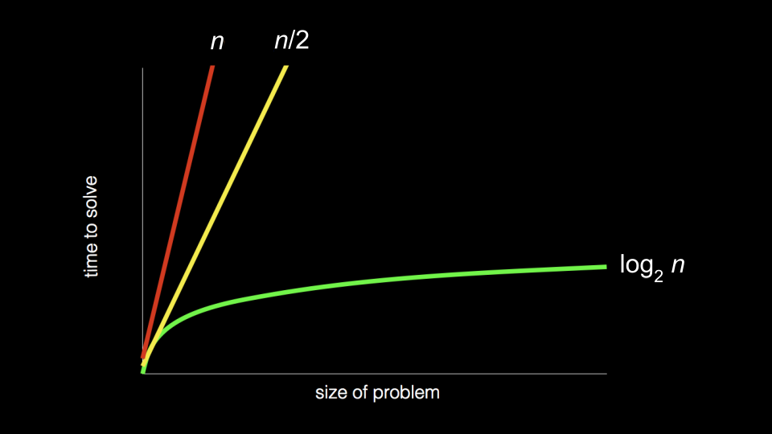

# Lecture 3: Algorithms

* [Search Algorithms](#search-algorithms)
    * [Linear Search](#linear-search)
    * [Binary Search](#binary-search)
* [Running Time](#running-time)
    * [Asymptotic Notation](#asymptotic-notation)
* [Structs](#structs)
* [Sorting Algorithms](#sorting-algorithms)
    * [Selection Sort](#selection-sort)
    * [Bubble Sort](#bubble-sort)
* [Recursion](#recursion)
    * [Merge Sort](#merge-sort)

## Search Algorithms

Methods for finding an element within a list (like an array.)

### Linear Search

Sequentially checking each elements of the list until a match is found.

### Binary Search

Continuously halfing the list and checking the middle elements until a match is found.

## Running Time

*Running time* involves an analysis using *big O* notation.

Computer scientists, rather than being ultra-specific about the mathematics,
efficiency is discussed in terms of *the order of* running various times.

In the above graph, the first algorithm is O(n) or *in the order of n*.
The second is in O(n) as well in that constants are dropped in big O.
The third is in O(log n).

### Asymptotic Notation

*Asymptotic notation* is the measure of how well algorithms perform as it scales.

* Big O Notation: Upper bound (worst case scenario)
	* O(n²): slowest running time
	* O(n log n)
	* O(n)
	* O(log n)
	* O(1): fastest running time

* Ω symbol: Lower bound (best case scenario)

* Θ symbol: When upper and lower bounds are the same.

## Structs

C allows the creation of unique data types via a `struct`.

Data type called `person` that has inside of it a `name` and a `number`:

    typedef struct
    {
        string name;
        string number;
    } person;

The code begins with `typedef struct` where a new datatype called `person` is defined.
Inside a `person` is a string called `name` and a `string` called `number`.

In the `main` function,
the `struct` can be accessed by creating an array called `people`
that is of type `person` that is of size 3.
Now, the names and phone numbers of the three people is in the `people` array.
`person` at the 0th location can be accessed and assigned that individual a name
using *dot notation* by `peopl[0].name`:

    int main(void)
    {
        person people[3];
    
        people[0].name = "Kelly";
        people[0].number = "+1-617-495-1000";
    
        people[1].name = "David";
        people[1].number = "+1-617-495-1000";
    
        people[2].name = "John";
        people[2].number = "+1-949-468-2750";
    
        // More lines of code
    }

## Sorting Algorithms

Methods for taking an unsorted list of values and transforming it into a sorted one.

### Selection Sort

Repeatedly selecting the smallest element from the unsorted portion
and swapping it with the first unsorted element.

Selection sort is *on the order of* O(n²)

It also has a lower bound of Ω(n²) therefore it is also Θ(n²).

### Bubble Sort

Repeatedly swapping elements for the larger elements to "bubble" up to the end.

It has a lower bound *on the order of* Ω(n)

## Recursion

### Merge Sort

    if only one number
        Quit
    Else
        Sort left half of numbers
        Sort right half of numbers
        Merge sorted halves

It is *on the order of* O(n log n).

And on the lower bound Ω(n log n) therefore also Θ(n log n).
