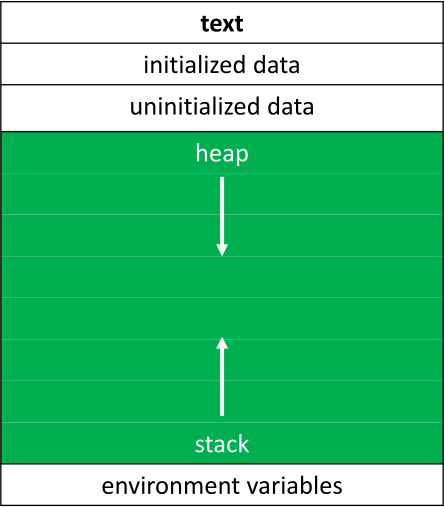

# Week-4 Shorts

* [Pointers](#pointers)
    * [Address Extraction](#address-extraction)
    * [Dereferencing](#dereferencing)
    * [Pointers annoyances](#pointers-annoyances)
* [Defining Custom Data Types](#defining-custom-data-types)
* [Dynamic Memory Allocation](#dynamic-memory-allocation)
    * [Integers](#integers)
    * [Array of Floats](#array-of-floats)

## Pointers

A **pointer** is a data item whose
* *value* is a memory address
* *type* describes the data located at that memory address

The simplest pointer available in C is the NULL pointer

When a pointer is created, and its value isn't set immediately,
the value of the pointer should **always** be set to NULL

### Address Extraction

A pointer can be created by **extracting** the address of
an already existing variable,
which can be done with the address extraction operator (`&`)

If `x` is an it-type variable,
then `&x` is a pointer-to-int whose value is the address of `x`

If `arr` is an array of double, then `&arr[i]` is a pointer-to-double
whose value is the address of the `i`th element  `arr`

An array's name is just a pointer to its first element

### Dereferencing

The main purpose of a pointer is for the location to which it points
to be modified or inspected---done by **dereferencing** the pointer

If a pointer-to-char is called `pc`,
then `*pc` is the data that lives at the memory address
stored inside the variable `pc`

In this context, `*` is known as the **dereference operator**

It "goes to the reference" and access data at that memory location,
allowing it to be manipulated at will

When trying to dereference a pointer whose value is NULL
a **Segmentation fault** occurs

```c
int *p;
```

The value of `p` is an address

`p` can be dereferenced with the `*` operator and an int would be found

### Pointers annoyances

`*` are an  important part of both the type name **and** the variable name

```c
int *pa, pb, pc;    // create a pointer pa, and two int pb, & pc
int *pa, *pb, *pc;  // create three pointers pa, pb, and pc
```


## Defining Custom Data Types

The C keyword `typedef` provides a way to create
a shorthand or rewritten name for data types

```c
typedef <oldname> <newname>

typedef unsigned char byte; // byte can now be used instead of unsigned char
```

`struct` can also be used

```c
struct car
{
    // structure of car
};

typedef struct car car_t

// or equivalently
typedef struct car
{
    
} car_t;
```


## Dynamic Memory Allocation

Pointers are used to access a block of **dynamically-allocated memory** at runtime

Dynamically-allocated memory comes from a pool of memory known as **heap**

Statically-allocated memory---used for local variables and function---has been
coming from a pool of memory known as the **stack**



Dynamically allocated memory can be obtained
by making a call to the C standard library function `malloc()`,
(requires `#include <stdlib.h>`)
passing as its parameter the number of bytes requested

If it can obtain the memory `malloc()` will return a pointer to that memory

If `malloc()` **can't** give the memory it'll hand back NULL.

### Integers

```c
// statically obtain an integer
int x;

// dynamically obtain an integer
int *px = malloc(4);
// or equivalently
int *px = malloc(sizeof(int));
```

### Array of Floats

```c" 
// get an integer from the user
int x = get_int();

// array of floats on the stack
float stack_array[x];

// array of floats on the heap
float* heap_array = malloc(x * sizeof(float));
```
### Memory Leaks

Dynamically-allocated memory is not automatically returned to the system
for later use when the function in which it's created finishes execution

Failing to return (or release) enough memory back to the system
when it is no longer in use results in a **memory leak**
which can compromise the system's performance

When the work with dynamically-allocated memory is finished,
it must `free()`d

#### 3 Golden Rules

1. Every block of memory that is `malloc()` must subsequently be `free()`d
2. Only memory that is `malloc()`d should be `free()`d
3. Do not `free()` a block of memory more than once


## File Pointers

The ability to read and write data to files is the primary means
of storing **persistent data** the abstraction of which provided by C
is implemented in a data structure known as `FILE`

Almost universally when working with files pointers will be used, `FILE*`

### File Manipulation Functions

The file manipulation functions live all live in `stdio.h`

All of them accept `FILE*` as one of their parameters,
except for the function `fopen()`, which is used to get a file pointer in the first place

Some of the most commonly used file input/output (I/O) functions are

| `fopen()` | `fclose()` | `fget()` | `fputc()` | `fread()` | `fwrite()` |
| --------- | ---------- | -------- | --------- | --------- | ---------- |

* `fopen()`

Opens a file and return a file pointer to it

Always make sure the return isn't `NULL`

    FILE* ptr = fopen(<filename>, <operation>);


* `fclose()`

Closes the file pointed by the given file pointer

    fclose(<file pointer>);


* `fgetc()`

Reads and returns the next character from the file pointed to

Note: The operation of the file pointer passed in as a parameter
must be "`r`" for read, or else there will be an error

    char ch = fgetc(<file pointer>);


* `fputc()`

Writes or appends the specified character to the pointed-to file

Note: The operation of the file pointer passed in as a parameter
must be "`w`" for write or "`a`" for append

    fputc(<character>, <file pointer>);


* `fread()`

Reads `<qty>` units of size `<size>` from the file pointed to
and stores them in memory in a buffer (usually an array) pointed to by `<buffer>`

Note: The operation of the file pointer passed in as a parameter
must be "`r`" for read

    fread(<buffer>, <size>, <qty>, <file pointer>);


* `fwrite()`

Writes `<qty>` units of size `<size>` from the file pointed to
by writing them from a buffer (usually an array) pointed to by `<buffer>`

Note: The operation of the file pointer passed in as a parameter
must be "`w`" for write or "`a`" for append

    fwrite(<buffer>, <size>, <qty>, <file pointer>);


There are lots of other useful functions abound in `stdio.h`

|  Function   | Description |
| :---------: | :---------- |
| `fgets()`   | Reads a full string from a file.                                |
| `fputs()`   | Writes a full string to a file.                                 |
| `fprintf()` | Writes a formatted string to a file.                            |
| `fseek()`   | Allows you rewind or fast-forward within a file.                |
| `ftell()`   | Tells you at what (byte) position you are at within a file.     |
| `feof()`    | Tells you whether you've read to the end of a file.             |
| `ferror()`  | Indicates whether an error has occurred in working with a file. |
